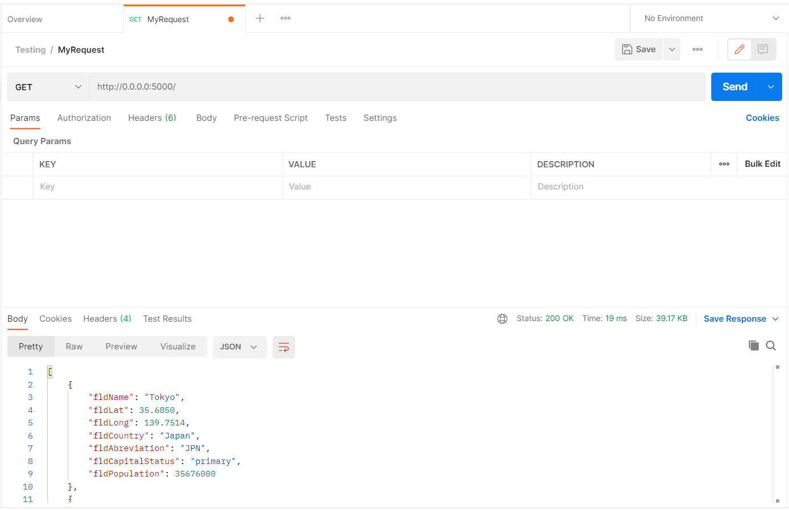
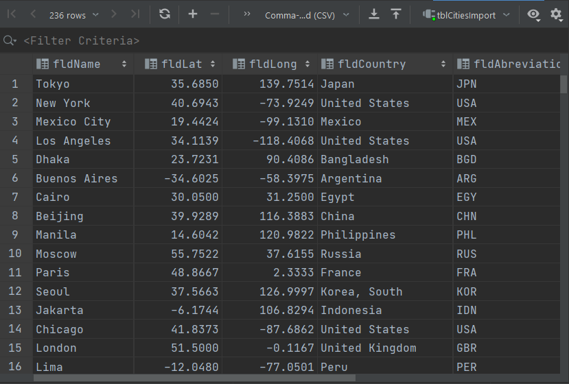
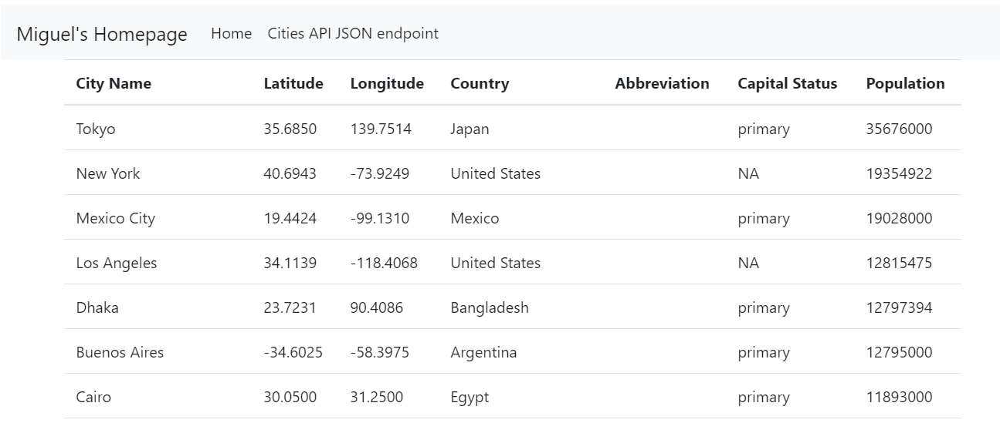

# Project Description
This project is a homework assignment to teach how to get PyCharm setup with Docker, Flask, MySQL, and Postman
# Postman Screenshot
Postman Request Output

# SQL Data Screenshot
PyCharm Data Query

# Flask and Templates

